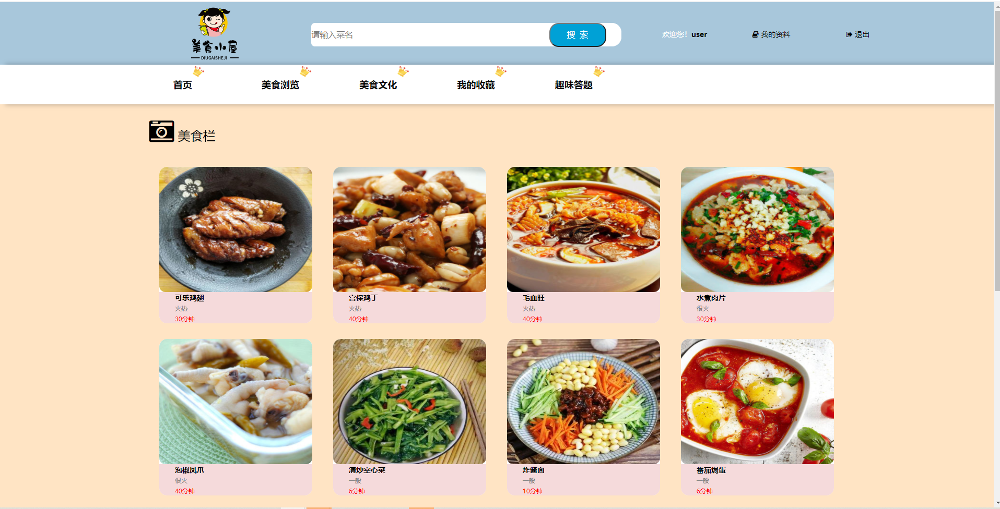
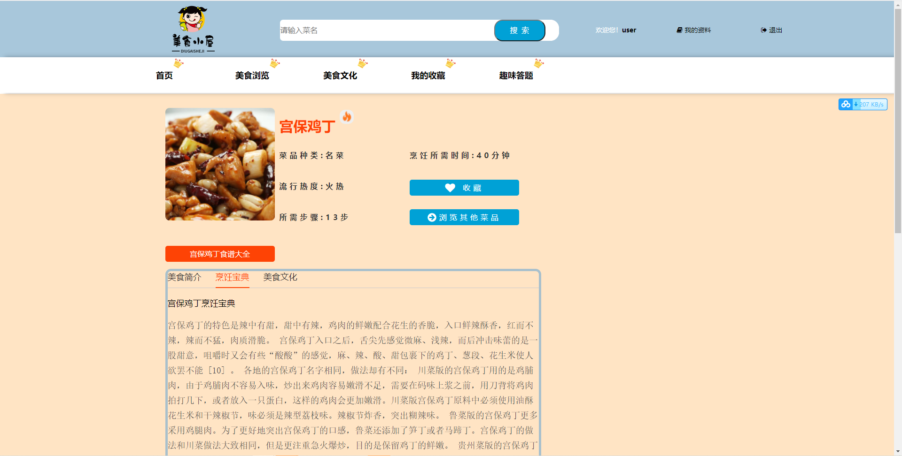
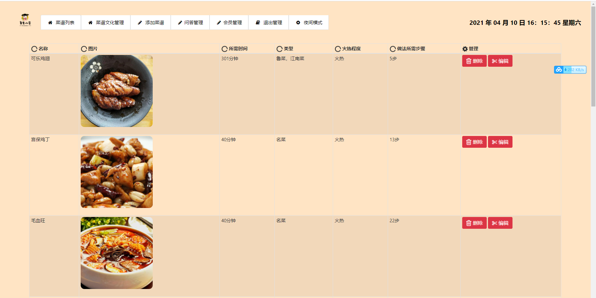

## 基于SpringBoot的美食设计网站

###  获取sql数据库文件: 从戎源码网 (https://armycodes.com/) QQ: 386869957 QQ群: 377586148
###  所有系统地址: (https://github.com/YuLin-Coder/AllProjectCatalog) 
###  所有项目以及源代码本人均调试运行无问题 可支持远程安装部署调试、定制修改、代码讲解

## 项目介绍
基于SpringBoot的美食设计网站，有用户和管理员两个角色，主要功能如下

### 【管理员】:
1. 菜谱列表：管理员可以查看和管理网站上发布的菜谱信息。
2. 菜谱文化管理：管理并编辑美食文化相关的内容和资料。
3. 添加菜谱：管理员可以添加新的菜谱信息到网站数据库中。
4. 问答管理：管理美食相关的问答内容，包括审核、编辑和删除等操作。
5. 会员管理：管理网站会员的信息。

### 【前台】:
1. 首页：展示网站的主要信息和推荐内容。
2. 美食浏览：提供用户浏览各种美食菜品的页面。
3. 美食文化：介绍美食背后的文化历史和相关知识。
4. 我的收藏：用户可以查看和管理自己收藏的美食菜谱。
5. 趣味答题：用户可以参与有趣的美食相关答题活动。

## 项目技术
- 编程语言：Java
- 数据库：MySQL
- 项目管理工具：Maven
- 前端技术：JSP+Layui+Bootstrap
- 后端技术：SpringBoot

## 运行环境
- JDK版本：JDK1.8及以上
- 开发工具：IDEA、Ecplise、Myecplise都可以
- 数据库: MySQL5.7及以上
- Maven：maven3.0及以上
- Node：14.14.0及以上

## 运行截图

